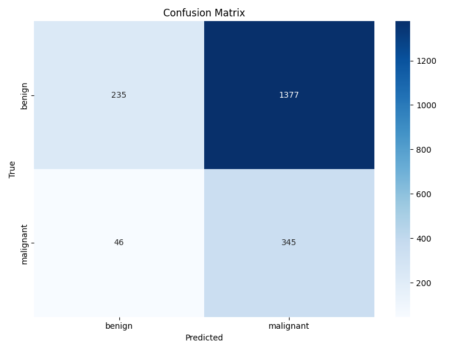

🩺 Skin Lesion Classifier (HAM10000 + Grad-CAM)

A deep learning pipeline for skin lesion classification (benign vs malignant) using the HAM10000 dataset.
Built with TensorFlow 2.x, trained on Apple Silicon (M1 GPU acceleration), and deployed via a FastAPI inference server.

🚀 Features

Transfer learning with EfficientNetV2-B0.

Binary classification: benign vs malignant.

Training pipeline with train.py.

Evaluation scripts: confusion matrix + classification report.

Grad-CAM visualization to highlight regions influencing predictions.

REST API server powered by FastAPI.

Optimized for Apple Silicon (M1/M2) with Metal backend.

📂 Repository Structure
skin-lesion-classifier/
│── app/                     # Frontend HTML (optional)
│── data/                    # Dataset (train/val splits prepared)
│── models/                  # Saved model + class names
│── utils/                   # Helper scripts (gradcam.py, etc.)
│── scripts/                 # Evaluation scripts
│── train.py                 # Training entry point
│── main.py                  # FastAPI server
│── README.md                # Project documentation

⚙️ Setup
1. Clone the repo
git clone https://github.com/naif1980ss/skin-lesion-classifier.git
cd skin-lesion-classifier

2. Create environment
conda create -n tf-mac python=3.11
conda activate tf-mac
pip install -r requirements-apple-silicon.txt

3. Prepare dataset

Download HAM10000 and place all .jpg files + HAM10000_metadata.csv in data/raw/.
Then run:

python prepare_ham10000.py \
  --raw-dirs data/raw \
  --metadata data/raw/HAM10000_metadata.csv \
  --out-dir data \
  --train 0.8 --val 0.2 --binary

🏋️ Training
python train.py --epochs 10 --img-size 224 --batch-size 32

📊 Evaluation
python scripts/evaluate_test.py \
  --data data/val --img 224 --batch 32 --outdir eval

Outputs:

eval/confusion_matrix.png

eval/classification_report.txt

🔥 Grad-CAM Visualization
IMG=$(ls data/val/benign | head -n1)
python utils/gradcam.py \
  --image "data/val/benign/$IMG" \
  --out gradcam_example.jpg

🌐 Inference API

Run the FastAPI server:

uvicorn main:app --reload

Open docs at:
👉 http://127.0.0.1:8000/docs

Send an image for prediction:

curl -X POST "http://127.0.0.1:8000/predict" \
  -F "file=@data/val/benign/sample.jpg"

📈 Results

Accuracy:
              precision    recall  f1-score   support

      benign     0.8363    0.1458    0.2483      1612
   malignant     0.2003    0.8824    0.3265       391

    accuracy                         0.2896      2003
   macro avg     0.5183    0.5141    0.2874      2003
weighted avg     0.7122    0.2896    0.2636      2003

🛠️ Tech Stack

TensorFlow 2.15 / 2.16

Keras

FastAPI + Uvicorn

NumPy / Pillow / Matplotlib

Tested on macOS (Apple Silicon, M1)

📌 TODO / Future Work

Multi-class lesion classification (7 classes).

Hyperparameter tuning.

Docker container for easy deployment.

Deploy on cloud (AWS / GCP / Azure).

📜 License

MIT License © 2025 Naif Allehyani
